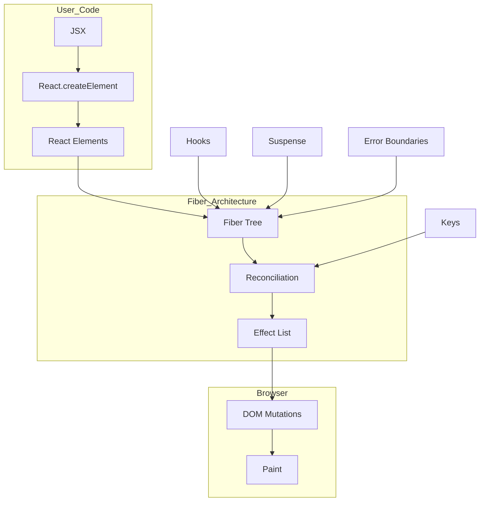

# Introduction to Fiber Architecture - FAANG Interview Deep Dive

> A Senior Staff Engineer's guide to mastering React's revolutionary internal architecture for top-tier technical interviews.

---

## 🎯 1. CONCEPT OVERVIEW (5 min read)

### What is Fiber Architecture?

**Fiber** is React's internal reconciliation engine, completely rewritten from scratch in React 16 (2017). It's the data structure and algorithm that powers how React builds, updates, and commits changes to the UI.

A **Fiber** is:
1. A JavaScript object representing a unit of work
2. A data structure that corresponds to a component instance
3. A node in React's internal tree structure

### The Problem It Solves

The old **Stack Reconciler** had a critical flaw:

```
┌──────────────────────────────────────────────────────────┐
│                    STACK RECONCILER                       │
│                                                          │
│   Start Render ──────────────────────────────► Commit    │
│        │                                          │      │
│        │    ❌ CANNOT PAUSE OR INTERRUPT          │      │
│        │    ❌ BLOCKS MAIN THREAD                 │      │
│        │    ❌ UI BECOMES UNRESPONSIVE            │      │
│        ▼                                          ▼      │
│   [====================================] 100ms+          │
│                                                          │
│   Result: Janky animations, input lag, dropped frames    │
└──────────────────────────────────────────────────────────┘
```

The Fiber architecture solves this with **incremental rendering**:

```
┌──────────────────────────────────────────────────────────┐
│                    FIBER RECONCILER                       │
│                                                          │
│   Work │ Pause │ Work │ Pause │ Work │ Commit            │
│    ▼      ▼       ▼      ▼       ▼       ▼               │
│   [==]  user   [==]  anim   [==]  [====]                 │
│         input        frame                               │
│                                                          │
│   ✓ Can pause and resume                                 │
│   ✓ Can prioritize urgent updates                        │
│   ✓ Main thread stays responsive                         │
│   ✓ Smooth 60fps animations                              │
└──────────────────────────────────────────────────────────┘
```

### Historical Context

| Version | Year | Reconciler | Key Feature |
|---------|------|-----------|-------------|
| React 0-15 | 2013-2016 | Stack | Synchronous, recursive |
| React 16 | 2017 | Fiber | Async-capable, incremental |
| React 18 | 2022 | Fiber + Concurrent | Full async rendering |

### The Interview One-Liner

> "Fiber is React's internal reconciliation engine—a linked-list data structure representing units of work that enables incremental, interruptible rendering with priority-based scheduling, making React 18's concurrent features possible."

---

## 🧠 2. MENTAL MODEL (10 min read)

### How to Think About Fiber

Think of Fiber as **React's task manager**. Instead of treating rendering as one big, atomic operation, Fiber breaks it into tiny "work units" that can be scheduled, paused, resumed, or abandoned.

### The Task Manager Analogy

```
Old React (Stack):
┌────────────────────────────────────────┐
│  Your app is like a single-threaded   │
│  chef who must finish the entire      │
│  meal before serving anyone.          │
│                                        │
│  👨‍🍳: "I'll cook everything first,    │
│       nobody interrupt me!"            │
│                                        │
│  🧑‍🤝‍🧑: *waits 2 minutes, gets angry*   │
└────────────────────────────────────────┘

New React (Fiber):
┌────────────────────────────────────────┐
│  Your app is like a smart chef with   │
│  a task list who can multitask.       │
│                                        │
│  👨‍🍳: "I'll chop vegetables... wait,  │
│       table 5 needs water? BRB!"       │
│                                        │
│  🧑‍🤝‍🧑: *gets served immediately*       │
└────────────────────────────────────────┘
```

### The "Aha Moment" Explanation

**Old React**: Recursive function calls that can't be interrupted
```javascript
// Conceptual Stack Reconciler (simplified)
function reconcile(element, container) {
  // Once this starts, it MUST finish
  // JavaScript call stack holds all the context
  for (let child of element.children) {
    reconcile(child, element); // Recursive - can't stop!
  }
}
```

**Fiber React**: Iterative loop with explicit state that CAN be interrupted
```javascript
// Conceptual Fiber Reconciler (simplified)
function workLoop() {
  while (workInProgress !== null && !shouldYield()) {
    // Each iteration is a "unit of work"
    // We can stop after ANY iteration!
    workInProgress = performUnitOfWork(workInProgress);
  }
  
  if (workInProgress !== null) {
    // Schedule remaining work for later
    requestIdleCallback(workLoop);
  }
}
```

The key insight: **Moving from the JavaScript call stack to our own data structure (Fiber) lets us pause and resume at will.**

### Visual: Fiber Tree Structure

```
                    ┌──────────────────┐
                    │   FiberRoot      │
                    │   (container)    │
                    └────────┬─────────┘
                             │ current
                             ▼
                    ┌──────────────────┐
                    │   HostRoot       │ ◄──── alternate ────┐
                    │   Fiber          │                     │
                    └────────┬─────────┘                     │
                             │ child                         │
                             ▼                               │
                    ┌──────────────────┐              ┌──────┴───────┐
                    │   App Fiber      │              │  Work-in-    │
                    │   (component)    │              │  Progress    │
                    └────────┬─────────┘              │  Tree        │
                             │ child                  └──────────────┘
                             ▼
              ┌──────────────┴───────────────┐
              ▼                              ▼
     ┌──────────────┐  sibling     ┌──────────────┐
     │  Header      │ ───────────► │  Main        │
     │  Fiber       │              │  Fiber       │
     └──────────────┘              └──────────────┘
```

### Connections to Other React Concepts

| Concept | Relationship to Fiber |
|---------|----------------------|
| Virtual DOM | Elements → converted to → Fibers |
| Reconciliation | The diffing process that operates on Fibers |
| Hooks | State stored directly on Fiber nodes |
| Keys | Help Fiber match old/new nodes |
| Suspense | Uses Fiber's ability to pause render |
| Transitions | Uses Fiber's priority scheduling |
| Error Boundaries | Fiber tree enables error propagation |

---

## 🔬 3. DEEP INTERNALS (15 min read)

### The Fiber Data Structure

```typescript
// Simplified Fiber node structure
interface Fiber {
  // ═══════════════════════════════════════════════════════
  // IDENTITY
  // ═══════════════════════════════════════════════════════
  tag: WorkTag;           // Type: FunctionComponent, ClassComponent, HostComponent, etc.
  key: null | string;     // Unique key for reconciliation
  type: any;              // Function, class, or tag name ('div')
  
  // ═══════════════════════════════════════════════════════
  // TREE STRUCTURE (Linked List)
  // ═══════════════════════════════════════════════════════
  return: Fiber | null;   // Parent fiber
  child: Fiber | null;    // First child fiber  
  sibling: Fiber | null;  // Next sibling fiber
  index: number;          // Position among siblings
  
  // ═══════════════════════════════════════════════════════
  // STATE
  // ═══════════════════════════════════════════════════════
  pendingProps: any;      // New props to apply
  memoizedProps: any;     // Props from last render
  memoizedState: any;     // State from last render (hooks linked list!)
  
  // ═══════════════════════════════════════════════════════
  // EFFECTS
  // ═══════════════════════════════════════════════════════
  flags: Flags;           // Side effects: Placement, Update, Deletion, etc.
  subtreeFlags: Flags;    // Bubbled up from children
  deletions: Fiber[];     // Child fibers to delete
  
  // ═══════════════════════════════════════════════════════
  // SCHEDULING
  // ═══════════════════════════════════════════════════════
  lanes: Lanes;           // Priority lanes for this fiber
  childLanes: Lanes;      // Priority lanes from children
  
  // ═══════════════════════════════════════════════════════
  // DOUBLE BUFFERING
  // ═══════════════════════════════════════════════════════
  alternate: Fiber | null; // Points to the other version
}
```

### Work Tags (Fiber Types)

```typescript
const FunctionComponent = 0;
const ClassComponent = 1;
const IndeterminateComponent = 2;  // Before we know if it's class/function
const HostRoot = 3;                // Root of the tree
const HostPortal = 4;              // React Portal
const HostComponent = 5;           // DOM element like 'div'
const HostText = 6;                // Text node
const Fragment = 7;
const Mode = 8;                    // StrictMode, ConcurrentMode
const ContextConsumer = 9;
const ContextProvider = 10;
const ForwardRef = 11;
const Profiler = 12;
const SuspenseComponent = 13;
const MemoComponent = 14;
const SimpleMemoComponent = 15;
const LazyComponent = 16;
// ... more types
```

### The Two Trees: Double Buffering

React maintains **two Fiber trees**:

```
┌─────────────────────────────────────────────────────────────────┐
│                         DOUBLE BUFFERING                        │
├─────────────────────────────────────────────────────────────────┤
│                                                                 │
│   CURRENT TREE                    WORK-IN-PROGRESS TREE         │
│   (what's on screen)              (what we're building)         │
│                                                                 │
│   ┌──────────┐                    ┌──────────┐                  │
│   │   App    │ ◄── alternate ───► │   App    │                  │
│   └────┬─────┘                    └────┬─────┘                  │
│        │                               │                        │
│   ┌────┴────┐                    ┌────┴────┐                    │
│   │  Header │ ◄── alternate ───► │  Header │  ← being worked on │
│   └─────────┘                    └─────────┘                    │
│                                                                 │
│   After commit: trees swap roles!                               │
│   WIP becomes Current, old Current becomes next WIP             │
│                                                                 │
└─────────────────────────────────────────────────────────────────┘
```

**Why double buffering?**
1. Keep displaying the current UI while building the new one
2. If update is interrupted, current tree is untouched
3. Enables smooth transitions between states

### The Render Phase: Work Loop

```javascript
// Simplified work loop (conceptual)
function workLoopSync() {
  while (workInProgress !== null) {
    performUnitOfWork(workInProgress);
  }
}

function workLoopConcurrent() {
  // In concurrent mode, we can yield to the browser
  while (workInProgress !== null && !shouldYield()) {
    performUnitOfWork(workInProgress);
  }
}

function performUnitOfWork(unitOfWork) {
  const current = unitOfWork.alternate;
  
  // "Begin" phase: process this fiber, return first child
  let next = beginWork(current, unitOfWork);
  
  unitOfWork.memoizedProps = unitOfWork.pendingProps;
  
  if (next === null) {
    // No children, complete this fiber and move to sibling/parent
    completeUnitOfWork(unitOfWork);
  } else {
    workInProgress = next;
  }
}
```

### Tree Traversal Order

Fiber uses a specific traversal pattern:

```
        App
       / | \
      A  B  C
     /|     |
    D E     F

Traversal order:
1. App (beginWork)
2.   A (beginWork)
3.     D (beginWork → completeWork)
4.     E (beginWork → completeWork)
5.   A (completeWork)
6.   B (beginWork → completeWork)
7.   C (beginWork)
8.     F (beginWork → completeWork)
9.   C (completeWork)
10. App (completeWork)

Down = beginWork (process, descend to child)
Up = completeWork (finish, go to sibling or parent)
```

### Effect Flags

Flags mark what side effects a fiber needs:

```typescript
const NoFlags = 0b0000000000000000000000000000;
const Placement = 0b0000000000000000000000000010;    // Insert into DOM
const Update = 0b0000000000000000000000000100;        // Update props/state
const Deletion = 0b0000000000000000000000001000;      // Remove from DOM
const ChildDeletion = 0b0000000000000000000000010000;
const ContentReset = 0b0000000000000000000000100000;
const Callback = 0b0000000000000000000001000000;      // Lifecycle callback
const Ref = 0b0000000000000000001000000000;           // Ref update
const Snapshot = 0b0000000000000000010000000000;      // getSnapshotBeforeUpdate
const Passive = 0b0000000000000000100000000000;       // useEffect
// ... many more
```

### Lanes: Priority System

```typescript
const NoLanes = 0b0000000000000000000000000000000;
const SyncLane = 0b0000000000000000000000000000001;          // Highest priority
const InputContinuousLane = 0b0000000000000000000000000100;  // Continuous input
const DefaultLane = 0b0000000000000000000000010000;          // Normal updates
const TransitionLane = 0b0000000000000000010000000000;       // startTransition
const IdleLane = 0b0100000000000000000000000000000;          // Lowest priority

// Higher bits = lower priority
// Multiple updates can be batched into same lane
```

### Hooks Storage on Fiber

```typescript
// Hooks are stored as a linked list on the fiber
fiber.memoizedState = {
  // First hook (e.g., useState)
  memoizedState: 0,       // Current state value
  baseState: 0,
  queue: { pending: null }, // Update queue
  next: {
    // Second hook (e.g., useEffect)
    memoizedState: {
      tag: HookPassive,
      create: () => {},   // Effect function
      destroy: () => {},  // Cleanup function
      deps: [],
    },
    next: {
      // Third hook...
      next: null
    }
  }
};
```

**This is why hooks must be called in the same order every render!** React walks through this linked list by position.

---

## 📝 4. SYNTAX & API (5 min read)

Fiber is an **internal implementation detail**—there's no public API to directly interact with it. However, several React APIs are designed around Fiber's capabilities:

### APIs Enabled by Fiber

```typescript
// Concurrent Features (React 18+)
import { 
  startTransition,
  useTransition,
  useDeferredValue
} from 'react';

// startTransition - mark update as low priority
startTransition(() => {
  setSearchResults(results);  // Won't block urgent updates
});

// useTransition - startTransition with pending state
const [isPending, startTransition] = useTransition();
startTransition(() => {
  setTab(nextTab);
});
// isPending is true while transition is rendering

// useDeferredValue - defer a value to lower priority
const deferredQuery = useDeferredValue(query);
// deferredQuery updates with lower priority than query
```

### Suspense (Leverages Fiber's Pause/Resume)

```typescript
import { Suspense, lazy } from 'react';

const LazyComponent = lazy(() => import('./HeavyComponent'));

function App() {
  return (
    <Suspense fallback={<Loading />}>
      <LazyComponent />
    </Suspense>
  );
}
```

### Error Boundaries (Leverages Fiber Tree Structure)

```typescript
class ErrorBoundary extends React.Component {
  state = { hasError: false };
  
  static getDerivedStateFromError(error) {
    return { hasError: true };
  }
  
  componentDidCatch(error, errorInfo) {
    // errorInfo.componentStack is built from Fiber tree
    console.log(errorInfo.componentStack);
  }
  
  render() {
    if (this.state.hasError) {
      return <h1>Something went wrong.</h1>;
    }
    return this.props.children;
  }
}
```

### DevTools Profiler API

```typescript
import { Profiler } from 'react';

function onRenderCallback(
  id,                // Profiler tree id
  phase,             // "mount" | "update"
  actualDuration,    // Time spent rendering
  baseDuration,      // Estimated time without memo
  startTime,
  commitTime
) {
  // Uses Fiber's timing data
  console.log(`${id} ${phase}: ${actualDuration}ms`);
}

<Profiler id="App" onRender={onRenderCallback}>
  <App />
</Profiler>
```

---

## 💻 5. CODE EXAMPLES (15 min read)

### Example 1: Understanding Fiber Through useTransition

```jsx
import { useState, useTransition } from 'react';

function SearchResults() {
  const [query, setQuery] = useState('');
  const [results, setResults] = useState([]);
  const [isPending, startTransition] = useTransition();

  const handleChange = (e) => {
    // Urgent update: input must feel responsive
    setQuery(e.target.value);

    // Low-priority update: can be interrupted
    // Fiber enables this by assigning different lanes
    startTransition(() => {
      const filtered = heavyFilter(data, e.target.value);
      setResults(filtered);
    });
  };

  return (
    <div>
      <input value={query} onChange={handleChange} />
      
      {/* isPending indicates Fiber is still working on transition */}
      <div style={{ opacity: isPending ? 0.5 : 1 }}>
        {results.map(r => <ResultItem key={r.id} data={r} />)}
      </div>
    </div>
  );
}

// What happens in Fiber:
// 1. handleChange fires
// 2. setQuery creates SyncLane update (high priority)
// 3. startTransition creates TransitionLane update (low priority)
// 4. React processes SyncLane first - UI updates immediately
// 5. React processes TransitionLane - can pause for user input
// 6. If user types again, TransitionLane work is abandoned
```

### Example 2: Real-World: Virtualized List with Concurrent Rendering

```jsx
import { useDeferredValue, useMemo, memo } from 'react';

// Production-quality component leveraging Fiber's capabilities
function VirtualizedList({ items, filter }) {
  // Defer the filter to prevent blocking scroll
  const deferredFilter = useDeferredValue(filter);
  
  // Memoize filtered results
  const filteredItems = useMemo(() => {
    if (!deferredFilter) return items;
    return items.filter(item => 
      item.name.toLowerCase().includes(deferredFilter.toLowerCase())
    );
  }, [items, deferredFilter]);
  
  // Show stale indicator when deferred value lags behind
  const isStale = filter !== deferredFilter;
  
  return (
    <div 
      className="list-container"
      style={{ opacity: isStale ? 0.7 : 1 }}
    >
      {/* Only render visible items */}
      <VirtualWindow
        items={filteredItems}
        itemHeight={50}
        containerHeight={500}
        renderItem={(item) => <ListItem key={item.id} data={item} />}
      />
    </div>
  );
}

// Memoized list item - Fiber can skip reconciling unchanged items
const ListItem = memo(function ListItem({ data }) {
  return (
    <div className="list-item">
      <span>{data.name}</span>
      <span>{data.description}</span>
    </div>
  );
});
```

### Example 3: Advanced - Suspense with Multiple Boundaries

```jsx
import { Suspense, lazy, useState, useTransition } from 'react';

// Fiber enables this by tracking suspend state in the tree
const Comments = lazy(() => import('./Comments'));
const Sidebar = lazy(() => import('./Sidebar'));
const MainContent = lazy(() => import('./MainContent'));

function App() {
  const [tab, setTab] = useState('home');
  const [isPending, startTransition] = useTransition();

  const handleTabChange = (newTab) => {
    // Mark navigation as transition - don't show loading immediately
    startTransition(() => {
      setTab(newTab);
    });
  };

  return (
    <div className={isPending ? 'pending' : ''}>
      <Navbar onTabChange={handleTabChange} currentTab={tab} />
      
      {/* Nested Suspense boundaries - Fiber tracks each independently */}
      <Suspense fallback={<PageSkeleton />}>
        <div className="layout">
          {/* Sidebar can load independently */}
          <Suspense fallback={<SidebarSkeleton />}>
            <Sidebar tab={tab} />
          </Suspense>
          
          <main>
            {/* Main content loads in parallel */}
            <Suspense fallback={<ContentSkeleton />}>
              <MainContent tab={tab} />
              
              {/* Comments has its own boundary */}
              <Suspense fallback={<CommentsSkeleton />}>
                <Comments postId={tab} />
              </Suspense>
            </Suspense>
          </main>
        </div>
      </Suspense>
    </div>
  );
}

// Fiber tree during loading:
// - App fiber: normal
// - Suspense (outer): tracking 3 children suspended
// - Suspense (sidebar): shows fallback
// - Suspense (main): shows fallback
// - Suspense (comments): mounted but suspended
// Each boundary has its own fiber with suspend state
```

### Example 4: Anti-Pattern - Blocking the Main Thread

```jsx
// ❌ WRONG: Synchronous heavy computation blocks Fiber
function BadSearch({ items }) {
  const [query, setQuery] = useState('');
  
  // This runs synchronously on EVERY keystroke
  // Fiber can't interrupt - it's in the same synchronous task
  const filtered = items.filter(item => {
    // Expensive operation
    return complexMatch(item, query);
  });
  
  return (
    <div>
      <input 
        value={query} 
        onChange={(e) => setQuery(e.target.value)} // Janky!
      />
      {filtered.map(item => <Item key={item.id} data={item} />)}
    </div>
  );
}

// ✅ CORRECT: Use concurrent features
function GoodSearch({ items }) {
  const [query, setQuery] = useState('');
  const [isPending, startTransition] = useTransition();
  const [filtered, setFiltered] = useState(items);
  
  const handleChange = (e) => {
    const value = e.target.value;
    setQuery(value);  // Urgent: update input immediately
    
    // Let Fiber schedule this at lower priority
    startTransition(() => {
      const results = items.filter(item => complexMatch(item, value));
      setFiltered(results);
    });
  };
  
  return (
    <div>
      <input value={query} onChange={handleChange} />
      <div style={{ opacity: isPending ? 0.5 : 1 }}>
        {filtered.map(item => <Item key={item.id} data={item} />)}
      </div>
    </div>
  );
}
```

---

## ⚠️ 6. COMMON MISTAKES & PITFALLS (10 min read)

### Mistake 1: Not Using Concurrent Features for Heavy Updates

```jsx
// ❌ WRONG: All updates are synchronous
function Charts({ data }) {
  const [range, setRange] = useState([0, 100]);
  
  // Changing range re-renders ALL charts synchronously
  // Slider feels janky because Fiber processes everything at once
  return (
    <div>
      <Slider value={range} onChange={setRange} />
      {data.map(d => <HeavyChart key={d.id} data={d} range={range} />)}
    </div>
  );
}

// ✅ CORRECT: Defer heavy updates
function Charts({ data }) {
  const [range, setRange] = useState([0, 100]);
  const deferredRange = useDeferredValue(range);
  
  return (
    <div>
      <Slider value={range} onChange={setRange} /> {/* Responsive! */}
      {data.map(d => (
        <HeavyChart key={d.id} data={d} range={deferredRange} />
      ))}
    </div>
  );
}
```

### Mistake 2: Misunderstanding Concurrent Rendering Guarantees

```jsx
// ❌ WRONG: Assuming render always completes
function BrokenComponent() {
  const [data, setData] = useState(null);
  
  // This can cause issues in concurrent mode!
  // Render might be interrupted and run multiple times
  if (!data) {
    fetch('/api/data')  // Multiple fetches!
      .then(res => res.json())
      .then(setData);
  }
  
  return <div>{data?.value}</div>;
}

// ✅ CORRECT: Use effects for side effects
function CorrectComponent() {
  const [data, setData] = useState(null);
  
  useEffect(() => {
    let cancelled = false;
    
    fetch('/api/data')
      .then(res => res.json())
      .then(d => {
        if (!cancelled) setData(d);
      });
    
    return () => { cancelled = true; };
  }, []);
  
  return <div>{data?.value}</div>;
}
```

### Mistake 3: Wrapping Everything in Transitions

```jsx
// ❌ WRONG: Transition for everything
function Form() {
  const [isPending, startTransition] = useTransition();
  
  const handleSubmit = () => {
    // User expects immediate feedback for form submission!
    startTransition(() => {
      submitForm();  // Wrong - this should be urgent
    });
  };
  
  return <button onClick={handleSubmit}>Submit</button>;
}

// ✅ CORRECT: Transitions are for non-urgent updates
function SearchAndSubmit() {
  const [isPending, startTransition] = useTransition();
  const [query, setQuery] = useState('');
  
  // Transition for search results (deferrable)
  const handleSearch = (e) => {
    startTransition(() => {
      setQuery(e.target.value);
    });
  };
  
  // NO transition for form submit (urgent)
  const handleSubmit = () => {
    submitForm();  // Synchronous, blocking - user expects this
  };
  
  return (
    <div>
      <input onChange={handleSearch} />
      <button onClick={handleSubmit}>Submit</button>
    </div>
  );
}
```

### Mistake 4: Ignoring the Tearing Problem

```jsx
// ❌ WRONG: External state can "tear" in concurrent mode
const store = {
  value: 0,
  subscribe(listener) { /* ... */ },
  getSnapshot() { return this.value; }
};

function BrokenCounter() {
  // Reading from external store during render
  // Different fibers might see different values!
  const count = store.value;  // 🐛 Can cause tearing
  
  return <div>{count}</div>;
}

// ✅ CORRECT: Use useSyncExternalStore
import { useSyncExternalStore } from 'react';

function CorrectCounter() {
  const count = useSyncExternalStore(
    store.subscribe,
    store.getSnapshot
  );  // React ensures consistent reads
  
  return <div>{count}</div>;
}
```

### Mistake 5: Not Memoizing in Concurrent Mode

```jsx
// ❌ PROBLEM: Expensive computation re-runs on every fiber pass
function ExpensiveComponent({ data }) {
  // In concurrent mode, this might run multiple times per commit!
  const processed = expensiveCalculation(data);  // No memoization
  
  return <Chart data={processed} />;
}

// ✅ CORRECT: Memoize expensive computations
function OptimizedComponent({ data }) {
  const processed = useMemo(
    () => expensiveCalculation(data),
    [data]  // Only recompute when data changes
  );
  
  return <Chart data={processed} />;
}
```

---

## 🎭 7. INTERVIEW SCENARIOS (10 min read)

### Conceptual Questions

**Q1: "What is Fiber and why did React need it?"**

> **Model Answer:** "Fiber is React's reconciliation engine, rewritten for React 16. The old Stack Reconciler was recursive and synchronous—once it started, it had to finish, blocking the main thread. This caused jank for complex updates. Fiber reimplements reconciliation as an iterative loop over a linked-list data structure. Each node is a 'fiber' representing a unit of work. This allows React to pause rendering, prioritize urgent updates, and resume work later. It's what enables all of React 18's concurrent features like Suspense, transitions, and automatic batching."

**Q2: "Explain the double-buffering technique in Fiber"**

> **Model Answer:** "React maintains two Fiber trees: 'current' (what's displayed) and 'work-in-progress' (what we're building). Each fiber has an 'alternate' pointer to its counterpart in the other tree. During render, React builds the work-in-progress tree. If rendering is interrupted, the current tree remains untouched—the user sees no partial state. On commit, the trees swap: work-in-progress becomes current. The old current becomes the next work-in-progress, enabling fiber reuse and reducing object allocation."

**Q3: "How do hooks work with Fiber?"**

> **Model Answer:** "Hooks are stored as a linked list on the fiber's `memoizedState` property. Each hook call corresponds to a node in this list. When a component renders, React processes hooks in order, walking through the list. This is why hooks must be called in the same order every render—React matches them by position, not by name. The fiber persists between renders, so hook state persists. When state updates, React creates an update object, adds it to the hook's queue, and schedules a re-render on that fiber."

**Q4: "What are lanes in Fiber?"**

> **Model Answer:** "Lanes are Fiber's priority system, replacing the older 'expiration times' model. They're represented as bitmasks where each bit position indicates a priority level. SyncLane (bit 0) is highest priority for user blocking updates like input. TransitionLane is for non-urgent updates. IdleLane is for background work. Multiple updates can share a lane and batch together. React processes higher-priority lanes first. If a high-priority update comes in during a low-priority render, Fiber can interrupt and restart at the higher priority."

**Q5: "How does Suspense work with Fiber?"**

> **Model Answer:** "When a component suspends (throws a promise), Fiber catches it at the nearest Suspense boundary. The fiber for that subtree is marked as suspended. React shows the fallback, but keeps the suspended fiber tree in memory as 'offscreen.' When the promise resolves, React retries rendering that subtree. Fiber enables this because it can pause work, store the suspended state, and later resume exactly where it left off. The suspended component's fiber and all its state remain intact."

### Code Review Question

```jsx
// What's wrong with this code?
function DataTable({ userId }) {
  const [data, setData] = useState(null);
  const [filter, setFilter] = useState('');
  
  // Fetch on every render
  if (!data) {
    fetchData(userId).then(setData);
  }
  
  // Synchronous filter
  const filtered = data ? expensiveFilter(data, filter) : [];
  
  return (
    <div>
      <input value={filter} onChange={e => setFilter(e.target.value)} />
      <table>
        {filtered.map(row => <Row key={row.id} data={row} />)}
      </table>
    </div>
  );
}
```

**Issues:**
1. **Fetch in render body**: In concurrent mode, render might run multiple times. This causes duplicate fetches.
2. **No cleanup**: If userId changes, stale responses could overwrite fresh data.
3. **Synchronous expensive filter**: Blocks main thread, makes input janky.
4. **No loading state**: Poor UX during fetch.

**Fixed:**
```jsx
function DataTable({ userId }) {
  const [data, setData] = useState(null);
  const [filter, setFilter] = useState('');
  const deferredFilter = useDeferredValue(filter);
  
  // Effect for side effects
  useEffect(() => {
    let cancelled = false;
    setData(null);
    
    fetchData(userId).then(d => {
      if (!cancelled) setData(d);
    });
    
    return () => { cancelled = true; };
  }, [userId]);
  
  // Memoize expensive computation, use deferred value
  const filtered = useMemo(() => {
    return data ? expensiveFilter(data, deferredFilter) : [];
  }, [data, deferredFilter]);
  
  if (!data) return <Loading />;
  
  return (
    <div>
      <input 
        value={filter} 
        onChange={e => setFilter(e.target.value)} 
      />
      <table style={{ opacity: filter !== deferredFilter ? 0.7 : 1 }}>
        {filtered.map(row => <Row key={row.id} data={row} />)}
      </table>
    </div>
  );
}
```

### System Design Connection

When to mention Fiber in system design:

1. **Real-time dashboards**: "We'd use Fiber's concurrent features—transitions for chart updates so interactions stay smooth"

2. **Large lists**: "Virtualization combined with useDeferredValue prevents Fiber from blocking on scroll"

3. **Form-heavy apps**: "Understanding Fiber helps us batch updates correctly and use transitions for expensive validations"

4. **Micro-frontends**: "Each React root has its own Fiber tree, so they're isolated for fault tolerance"

---

## 🔗 8. CONNECTIONS & TRADE-OFFS (5 min read)

### How Fiber Connects to React Concepts



### Trade-off Table

| Aspect | Stack Reconciler | Fiber Reconciler |
|--------|------------------|------------------|
| Complexity | Simple recursive | Complex iterative |
| Bundle size | Smaller | ~10% larger |
| Memory | Lower (uses call stack) | Higher (explicit data structure) |
| Interruptibility | ❌ None | ✅ Full |
| Priority scheduling | ❌ None | ✅ Lanes system |
| Error recovery | Limited | Full component stacks |
| Debugging | Harder (call stack based) | Easier (persistent structure) |
| Concurrent features | ❌ Impossible | ✅ Enabled |

### When to Leverage Fiber Features

| Use Case | Recommended Approach |
|----------|---------------------|
| User input in heavy UI | `useTransition` or `useDeferredValue` |
| Data fetching | `Suspense` with proper boundaries |
| Background updates | `startTransition` |
| External state | `useSyncExternalStore` |
| Heavy computation | `useMemo` + concurrent features |
| Animations | Keep in sync lane, defer other updates |

---

## 🛠️ 9. HANDS-ON EXERCISES

### Exercise 1: Transition Priority (10 min)

**Task:** Create a component that demonstrates priority difference

```jsx
// Create a counter that updates two displays:
// 1. "Fast Counter" - should always show current value immediately
// 2. "Slow Counter" - can lag behind with visual indicator

// Requirements:
// - Single increment button
// - Fast display updates synchronously with each click
// - Slow display uses transition (shows opacity change when pending)
// - Click rapidly to see the difference

function PriorityDemo() {
  // Your implementation here
}
```

### Exercise 2: Suspense Boundaries (15 min)

**Task:** Build a dashboard with independent loading states

```jsx
// Requirements:
// - Three panels: Stats, Chart, RecentActivity
// - Each fetches data independently (simulate with lazy loading)
// - Each has its OWN loading skeleton
// - Parent page should show "Dashboard" immediately
// - Panels should stream in as they load
// - Add error boundaries for each panel

function Dashboard() {
  // Your implementation here
}
```

### Exercise 3: External Store with Fiber (15 min)

**Task:** Implement a concurrent-safe store

```jsx
// Requirements:
// - Create a simple store using useSyncExternalStore
// - Store should hold a counter value
// - Multiple components should subscribe
// - Updates should NOT cause tearing in concurrent mode
// - Add a startTransition update alongside a sync update

// Test by: wrapping in StrictMode and using transitions
```

---

## 🏗️ 10. MINI PROJECT (45-60 min)

### Project: Concurrent Search with Suspense

Build a GitHub user search that demonstrates Fiber's capabilities.

**Requirements:**
1. Search input that debounces with `useDeferredValue`
2. Results fetched via Suspense (use React 18's `use()` or a Suspense-compatible library)
3. Show stale indicator when deferred query lags
4. Error boundary for failed requests
5. Skeleton loading states
6. Cancel in-flight requests when query changes

**Acceptance Criteria:**
- [ ] Input never feels laggy, even with network delay
- [ ] "Stale" indicator shows when results don't match input
- [ ] Error displays in boundary, not crash
- [ ] Works correctly in `<StrictMode>`

**What interviewers look for:**
- Understanding of concurrent features
- Proper Suspense boundary placement
- Handling of race conditions
- Clean separation of concerns

---

## 🔍 11. DEBUGGING GUIDE

### Common Issues and Solutions

**Issue: Component renders multiple times in StrictMode**
```
Cause: StrictMode intentionally double-renders to catch side effects in render
Fix: This is expected! Move side effects to useEffect
```

**Issue: State seems to "tear" (inconsistent reads)**
```
Cause: Reading from external mutable source during render
Fix: Use useSyncExternalStore for external state
```

**Issue: Transition never completes**
```
Cause: Suspense throwing inside transition without boundary
Fix: Wrap suspended content in Suspense boundary
```

**Issue: useTransition isPending stuck at true**
```
Cause: Suspended promise never resolves or keeps changing
Fix: Ensure promise stability and resolution
```

### Debugging Tools

```jsx
// See fiber tree in DevTools
// Components tab → Select component → View "fiber" in console

// Profiler for render timing
<Profiler id="Component" onRender={(id, phase, duration) => {
  console.log(`${id} ${phase}: ${duration}ms`);
}}>
```

---

## 📊 12. PERFORMANCE CONSIDERATIONS

### How Fiber Affects Performance

| Factor | Impact | Mitigation |
|--------|--------|------------|
| More memory | Fiber nodes are objects | React reuses fibers via alternate |
| Object allocation | Each update creates objects | Pooling and reuse |
| Traversal overhead | Linked list vs array | Minimal—link following is fast |
| Priority calculation | Lane comparisons | Bitmask operations are O(1) |

### Measurement

```jsx
// Use Profiler API
<Profiler id="App" onRender={onRender}>
  <App />
</Profiler>

// Check for concurrent features impact
function onRender(id, phase, actualDuration, baseDuration) {
  // baseDuration = time without memo
  // actualDuration = actual time this render
  // If actualDuration << baseDuration, memoization is working
}
```

### When to Optimize

- ✅ Use transitions for expensive non-urgent updates
- ✅ Memoize expensive computations
- ✅ Use Suspense to show partial UI
- ❌ Don't wrap everything in transitions
- ❌ Don't over-memoize simple components

---

## ♿ 13. ACCESSIBILITY IMPLICATIONS

### Focus Management with Concurrent Features

```jsx
function Modal({ isOpen, onClose }) {
  const closeButtonRef = useRef(null);
  
  useEffect(() => {
    if (isOpen) {
      // Focus might arrive before render in concurrent mode
      // Use requestAnimationFrame for safety
      requestAnimationFrame(() => {
        closeButtonRef.current?.focus();
      });
    }
  }, [isOpen]);
  
  return (
    <div role="dialog" aria-modal="true">
      <button ref={closeButtonRef} onClick={onClose}>
        Close
      </button>
    </div>
  );
}
```

### Screen Readers and Transitions

```jsx
// Announce loading states for screen readers
function Search() {
  const [isPending, startTransition] = useTransition();
  
  return (
    <div>
      <input onChange={...} />
      
      {/* Live region for loading announcement */}
      <div 
        role="status" 
        aria-live="polite"
        aria-busy={isPending}
      >
        {isPending && 'Loading results...'}
      </div>
      
      <Results />
    </div>
  );
}
```

---

## 🧪 14. TESTING FIBER-RELATED CODE

### Testing Concurrent Features

```jsx
import { render, screen, act } from '@testing-library/react';

test('transition shows pending state', async () => {
  render(<TransitionComponent />);
  
  // Click to trigger transition
  await userEvent.click(screen.getByRole('button'));
  
  // Should show pending state during transition
  expect(screen.getByTestId('pending-indicator')).toBeInTheDocument();
  
  // Wait for transition to complete
  await waitFor(() => {
    expect(screen.queryByTestId('pending-indicator')).not.toBeInTheDocument();
  });
});
```

### Testing Suspense

```jsx
test('shows fallback while loading', async () => {
  render(
    <Suspense fallback={<div>Loading...</div>}>
      <AsyncComponent />
    </Suspense>
  );
  
  // Initial fallback
  expect(screen.getByText('Loading...')).toBeInTheDocument();
  
  // Wait for content
  await waitFor(() => {
    expect(screen.getByText('Loaded Content')).toBeInTheDocument();
  });
});
```

---

## 📚 15. QUICK REFERENCE CARD

```
┌─────────────────────────────────────────────────────────────┐
│              FIBER ARCHITECTURE CHEAT SHEET                 │
├─────────────────────────────────────────────────────────────┤
│                                                             │
│  WHAT IS FIBER?                                             │
│  A linked-list data structure for incremental rendering    │
│                                                             │
│  KEY PROPERTIES OF A FIBER:                                 │
│  • type - Component function/class or 'div'                 │
│  • key - Reconciliation hint                                │
│  • child/sibling/return - Tree structure                    │
│  • memoizedState - Hooks linked list                        │
│  • alternate - Double-buffered counterpart                  │
│  • lanes - Priority (SyncLane > TransitionLane > IdleLane)  │
│                                                             │
│  TWO PHASES:                                                │
│  Render (can pause) → Commit (cannot pause)                 │
│                                                             │
│  CONCURRENT APIS:                                           │
│  • startTransition(() => { ... })                           │
│  • useTransition() → [isPending, startTransition]           │
│  • useDeferredValue(value) → deferredValue                  │
│  • useSyncExternalStore(subscribe, getSnapshot)             │
│                                                             │
│  GOLDEN RULES:                                              │
│  ✓ Render phase must be pure (no side effects)              │
│  ✓ Use effects for side effects                             │
│  ✓ Use transitions for non-urgent updates                   │
│  ✓ Memoize expensive computations                           │
│  ✗ Don't read from external mutable stores in render        │
│                                                             │
└─────────────────────────────────────────────────────────────┘
```

---

## ✅ 16. SELF-ASSESSMENT CHECKLIST

Before moving on, you should be able to:

- [ ] Explain why React needed Fiber (Stack Reconciler limitations)
- [ ] Describe what a Fiber node contains
- [ ] Draw the double-buffering tree structure
- [ ] Explain how hooks are stored on fibers
- [ ] Describe the lane priority system
- [ ] Use `useTransition` and `useDeferredValue` correctly
- [ ] Explain concurrent rendering guarantees (and non-guarantees)
- [ ] Debug common concurrent mode issues
- [ ] Know when to use concurrent features vs when not to
- [ ] Implement Suspense boundaries correctly

---

## 🎤 17. INTERVIEW SCRIPT

### 30-Second Version (Elevator Pitch)

> "Fiber is React's internal reconciliation engine, introduced in React 16. It replaces the old synchronous, recursive algorithm with an incremental, interruptible one. Each component corresponds to a 'fiber' node in a linked-list tree. This architecture allows React to pause rendering, prioritize urgent updates like user input over background work, and enables all of React 18's concurrent features like Suspense, transitions, and automatic batching."

### 2-Minute Version (Detailed Explanation)

> "The old Stack Reconciler worked by recursively walking the component tree in a single, uninterruptible pass. For complex UIs, this could block the main thread for hundreds of milliseconds, causing janky animations and unresponsive inputs.
>
> Fiber solves this by reimplementing reconciliation as an iterative loop over an explicit data structure. Each component has a corresponding 'fiber' node containing its type, state, hooks, and pointers to its parent, child, and siblings. This forms a linked-list tree that React can traverse incrementally.
>
> There are two key innovations: First, **interruptibility**—since the work state is stored in fiber objects rather than the JS call stack, React can pause mid-render, let the browser handle a user event, then resume exactly where it left off.
>
> Second, **priority scheduling**—using a system called 'lanes,' React assigns different priorities to different updates. User input gets the highest priority (SyncLane), while background updates can use lower priorities (TransitionLane). If a high-priority update comes in during a low-priority render, React can abandon that work and start fresh.
>
> React also maintains two fiber trees—current and work-in-progress—for double buffering. This ensures users never see a partial state even if rendering is interrupted.
>
> This architecture is what enables React 18's concurrent features: Suspense for data fetching, transitions for non-urgent updates, and automatic batching for performance."

### 5-Minute Version (Deep Dive with Examples)

> "Let me walk you through Fiber from problem to implementation to application.
>
> **The Problem**: In React 15 and earlier, the reconciler was recursive. Given a component tree, it would start at the root and recursively process each child until done. The problem is JavaScript is single-threaded—this entire process blocked the main thread. For a tree with 1000 components, each taking 1ms to render, that's a full second of jank. User input wouldn't register, animations would stutter.
>
> **The Solution**: Fiber rewrites reconciliation as an iterative loop over an explicit data structure. Each component becomes a 'fiber' object with properties like:
> - `type`: the component function or DOM tag
> - `child/sibling/return`: pointers forming a linked-list tree
> - `memoizedState`: where hooks live as their own linked list
> - `alternate`: pointer to the fiber in the other tree
> - `lanes`: priority bitmask
>
> The work loop looks conceptually like this:
>
> ```javascript
> while (workInProgress && !shouldYield()) {
>   workInProgress = performUnitOfWork(workInProgress);
> }
> ```
>
> Each iteration processes one fiber. `shouldYield()` checks if the browser needs the thread back—maybe for a click handler or animation frame. If so, we save our place and reschedule.
>
> **Double Buffering**: React keeps two trees—'current' and 'work-in-progress.' While we build the new tree, the old one is still displayed. On commit, they swap. If we abandon work mid-render, the current tree is untouched.
>
> **Priority with Lanes**: Different updates get different priority bits. SyncLane (bit 0) is processed immediately—things like clicks. TransitionLane is for deferrable work—things like search results, or tab changes. When a high-priority update arrives during low-priority work, React abandons the in-progress tree and starts over at the higher priority.
>
> **Practical APIs**: This enables the concurrent features we use:
>
> ```javascript
> // startTransition marks updates as low priority
> startTransition(() => {
>   setSearchResults(data);  // Won't block input
> });
>
> // useDeferredValue gives you a 'lagging' version
> const deferredQuery = useDeferredValue(query);
> // deferredQuery updates at lower priority
>
> // Suspense relies on Fiber's ability to pause
> <Suspense fallback={<Loading />}>
>   <AsyncComponent />  // Throws promise → caught, paused
> </Suspense>
> ```
>
> **In System Design**: I'd mention Fiber when discussing real-time UIs, large lists, or complex forms. Understanding that React can now prioritize updates helps make better architecture decisions—we can split updates by urgency rather than trying to optimize everything equally."

---

*Document created for FAANG interview preparation. Master Fiber architecture and you'll understand the engine that powers modern React.*
